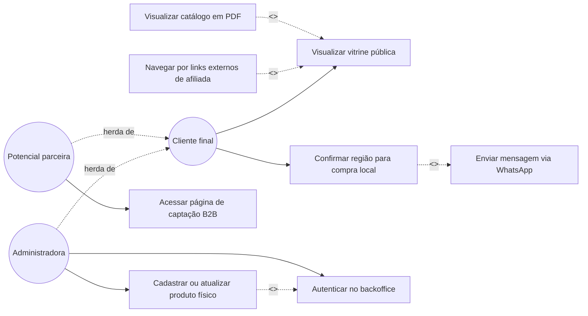

# Casos de Uso

## Atores
- Cliente final
- Revendedora / administradora (especialização de Cliente? Não — acesso restrito, herda de `Usuario` conceitual)
- Potencial parceira B2B (especialização do Cliente final)
- Sistema externo de matriz
- Sistema de WhatsApp

**Herança de ator:** `Potencial Parceira --|> Cliente final` (acessa parte da jornada pública e adiciona a captação B2B). A `Revendedora/Administradora` herda a capacidade de navegar pela vitrine, mas participa de casos de uso exclusivos do backoffice, tratados como generalização de um ator administrativo.

## Diagrama de casos de uso

> Leitura: `UC02` **sempre** executa `UC03` (include — o link do WhatsApp só é gerado após a confirmação da região). `UC04` e `UC05` são opcionais e apenas estendem a vitrine pública em ponto de extensão (extend). `UC07` sempre inclui `UC08` (autenticação obrigatória antes de gerenciar estoque).

## Casos de uso principais

### UC01 - Visualizar vitrine pública
**Ator:** Cliente final

**Descrição:** o cliente acessa a página principal e visualiza os blocos de venda local, links externos, catálogo e captação B2B.

**Fluxo principal:**
1. o cliente abre a landing page;
2. o sistema exibe os blocos e os produtos disponíveis;
3. o cliente navega pela interface.

**Pós-condição:** a experiência está disponível ao cliente com os blocos relevantes exibidos.

### UC02 - Confirmar região para compra local
**Ator:** Cliente final

**Descrição:** o cliente informa ou confirma a região de atendimento da revendedora para liberar o WhatsApp.

**Fluxo principal:**
1. o cliente acessa o bloco de estoque local;
2. o sistema apresenta o campo de confirmação ou validação de cidade;
3. o cliente confirma que está na área permitida;
4. o botão de WhatsApp é liberado.

**Fluxo alternativo:**
- se a região for inválida, o botão permanece bloqueado e o usuário recebe feedback visual.

### UC03 - Enviar mensagem via WhatsApp
**Ator:** Cliente final

**Descrição:** após a validação geográfica, o cliente é direcionado ao WhatsApp com mensagem pré-formatada.

**Fluxo principal:**
1. o cliente clica no botão de WhatsApp;
2. o sistema monta a URL com mensagem e produto;
3. o navegador abre o WhatsApp;
4. o cliente entra em contato com a revendedora.

### UC04 - Navegar por links externos de afiliada
**Ator:** Cliente final

**Descrição:** o cliente é direcionado para a loja oficial ou categorias específicas da matriz.

**Fluxo principal:**
1. o cliente clica em um card de deep link;
2. o sistema abre a URL externa;
3. o cliente é levado ao fluxo de compra oficial.

**Pós-condição:** a navegação do cliente é encurtada e sem fricção.

### UC05 - Visualizar catálogo em PDF
**Ator:** Cliente final

**Descrição:** o cliente acessa a apresentação do catálogo em PDF dentro da vitrine.

**Fluxo principal:**
1. o cliente acessa o bloco do catálogo;
2. o sistema abre o visualizador ou PDF;
3. o cliente navega pelo material.

### UC06 - Acessar página de captação B2B
**Ator:** Potencial parceira (herda de Cliente final)

**Descrição:** a pessoa acessa a página especializada para conhecer o programa de revenda.

**Fluxo principal:**
1. o cliente clica no CTA de parceria;
2. o sistema direciona para o fluxo separado;
3. o visitante entra em contato para conhecer o programa.

### UC07 - Cadastrar ou atualizar produto físico
**Ator:** Revendedora / administradora

**Relações:** `<<include>> UC08 - Autenticar no backoffice` (autenticação é obrigatória antes de gerenciar estoque).

**Descrição:** a administradora gerencia o estoque físico exibido na vitrine.

**Fluxo principal:**
1. a administradora acessa o backoffice;
2. realiza login;
3. cadastra ou edita produto;
4. define categoria, preço, imagem e disponibilidade;
5. salva as alterações.

**Pós-condição:** o item fica disponível ou oculto conforme a regra de publicação.

### UC08 - Autenticar no backoffice
**Ator:** Revendedora / administradora

**Descrição:** a administradora entra no painel administrativo com acesso seguro.

**Fluxo principal:**
1. a usuária informa credenciais;
2. o sistema valida a autenticação;
3. o painel é liberado.

**Fluxo alternativo:**
- se as credenciais forem inválidas, o sistema exibe mensagem de erro.

## Fluxos principais
- visita pública;
- validação geográfica;
- WhatsApp local;
- click em link externo;
- acesso ao PDF;
- CTA B2B;
- gestão de estoque físico no admin.

## Fluxos alternativos
- cliente fora da região de atendimento;
- produto indisponível;
- link externo quebrado ou desatualizado;
- login administrativo inválido;
- material de catálogo indisponível.
