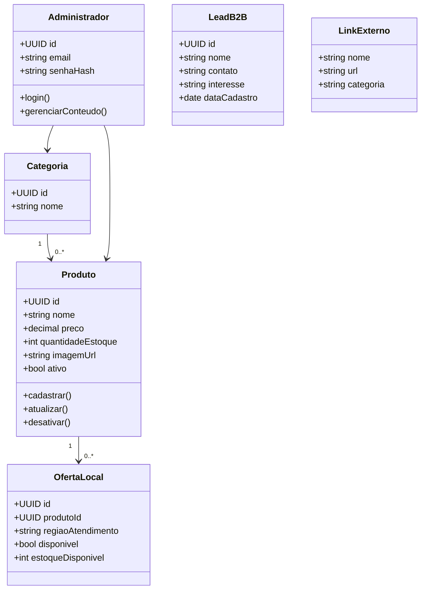

# Diagrama de Classes

## Entidades de domínio

### Produto
Representa um item físico disponível para venda na região da revendedora.

### Categoria
Agrupa produtos por tema, como skincare, bem-estar, perfumes ou kits.

### Administrador
Usuário autenticado com permissão para gerenciar conteúdo e estoque.

### OfertaLocal
Registra a disponibilidade do produto para venda local, com estoque e região de atendimento.

### LeadB2B
Representa o interesse de um potencial parceiro na captação de revenda.

## Value Objects
- Preco
- RegiaoAtendimento
- ContatoWhatsApp
- UrlExterna

## Relacionamentos
- `Categoria` possui muitos `Produto`
- `Produto` pode ter uma ou mais `OfertaLocal`
- `Administrador` gerencia `Produto` e `Categoria`
- `LeadB2B` é independente da venda física
- `LinkExterno` é um valor de configuração externo, sem persistência como produto

## Observações de design
- `Produto` é a raiz do agregado de estoque físico.
- a trava geográfica não é uma entidade persistente, mas uma regra de interface e UX;
- links de afiliada são tratados como configuração de navegação externa, não como entidade de produto.

