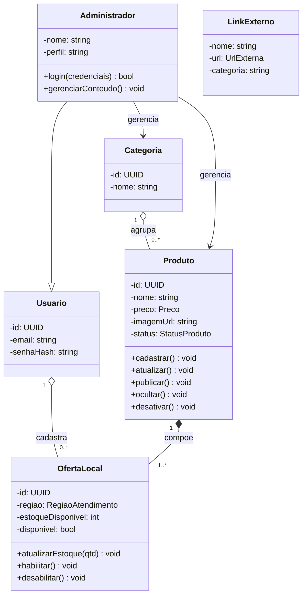

# Diagrama de Classes

## Entidades de domínio

### Produto
Representa um item físico disponível para venda na região da revendedora. **Raiz do agregado** de estoque físico.

### Categoria
Agrupa produtos por tema, como skincare, bem-estar, perfumes ou kits.

### OfertaLocal
Registra a disponibilidade do produto para venda local, com estoque e região de atendimento.

### Administrador
Usuário autenticado com permissão para gerenciar conteúdo e estoque. Herda propriedades de `Usuario`.

### Usuario
Classe geral que concentra identidade e credenciais compartilhadas.

### LinkExterno
Valor de configuração externa (não persistente como entidade de produto).

## Value Objects
- Preco (embutido em Produto como valor imutável)
- RegiaoAtendimento (embutido em OfertaLocal)
- ContatoWhatsApp (monta a mensagem pré-formatada)
- UrlExterna (usado por LinkExterno)

## Relacionamentos e multiplicidades
- `Usuario "1" --> "0..*" OfertaLocal` — agregação: o cadastro da oferta pode existir de forma independente (associação fraca "tem um").
- `Produto "1" *-- "1..*" OfertaLocal` — composição: a OfertaLocal não existe sem o Produto (ciclo de vida atrelado); Produto é todo, OfertaLocal é parte.
- `Categoria "1" --> "0..*" Produto` — agregação fraca: Produto pode existir sem Categoria.
- `Administrador --|> Usuario` — herança (generalização): "é um" Usuario.
- `Administrador --> Produto` e `Administrador --> Categoria` — associação de gestão.
- `LeadB2B` é independente da venda física.
- `LinkExterno` é um valor de configuração externo, sem persistência como produto.

## Observações de design
- `Produto` é a raiz do agregado de estoque físico.
- a trava geográfica não é uma entidade persistente, mas uma regra de interface e UX;
- links de afiliada são tratados como configuração de navegação externa, não como entidade de produto.

## Persistência

| Classe | Persistente? | Estratégia | Observação |
|--------|-------------|-----------|------------|
| Produto | Sim | Tabela `produtos`, PK uuid | Aggregate root |
| Categoria | Sim | Tabela `categorias`, PK uuid | — |
| OfertaLocal | Sim | Tabela `ofertas_locais`, PK uuid, FK produto_id | Composição com Produto |
| Administrador | Sim | Tabela `administradores`, PK uuid | Herda de Usuario |
| Login/Status | Não (enum/valor) | Embutido | — |
| LeadB2B | Sim | Tabela `leads_b2b`, PK uuid | Independente |
| LinkExterno | Não | Configuração/CMS | Não entra no MER |
| Preco, RegiaoAtendimento, ContatoWhatsApp, UrlExterna | Não (value object) | Colunas embutidas | Valor imutável |

## DER
Ver seção 5 (`05-diagrama-er.md`) — derivação das tabelas a partir da tabela de persistência acima.
