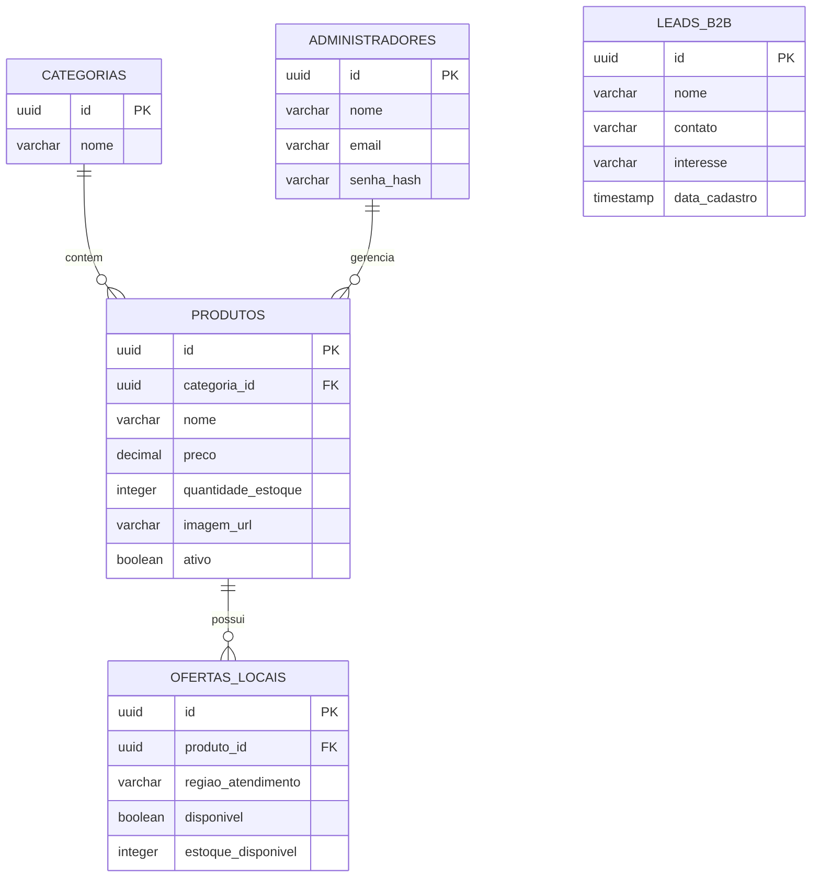

# Diagrama Entidade-Relacionamento (MER)

## Entidades persistentes
- `categorias`
- `produtos`
- `ofertas_locais`
- `administradores`
- `leads_b2b`

## Relacionamentos
- uma categoria pode ter muitos produtos;
- um produto pode ter várias ofertas locais;
- um administrador pode gerenciar vários produtos;
- um lead B2B é um registro independente e não depende de produtos físicos.

## Observações
- o banco guarda somente o estoque físico e os dados operacionais do negócio;
- links de afiliada não fazem parte do MER principal;
- a região geográfica da venda fica como regra de interface e configuração operacional, e não como entidade central de produto.

