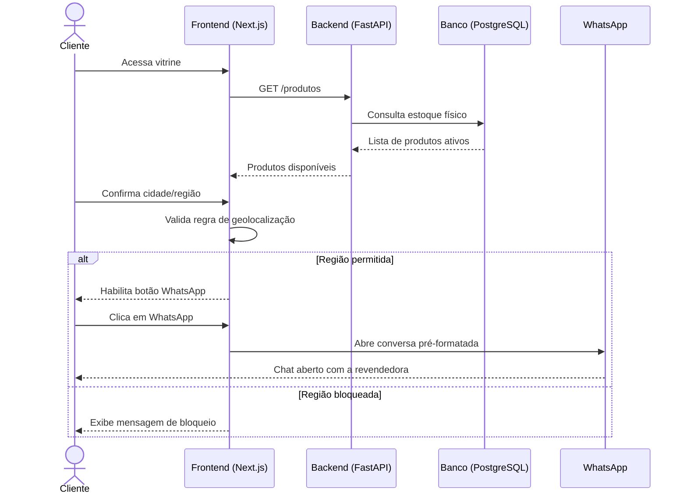
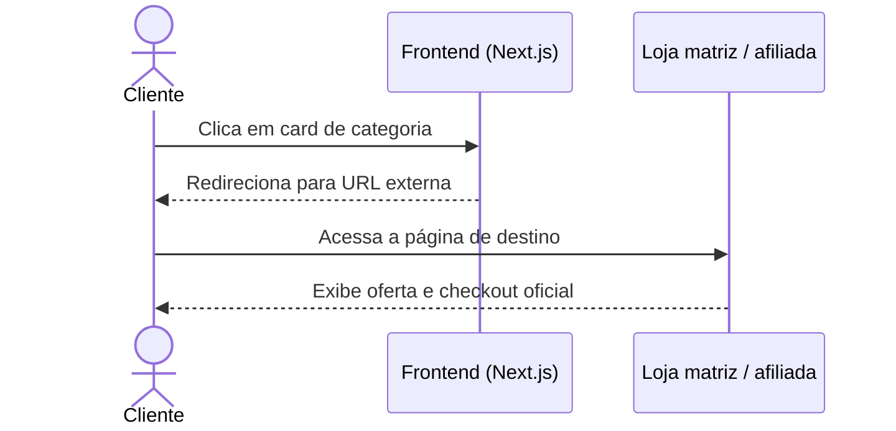
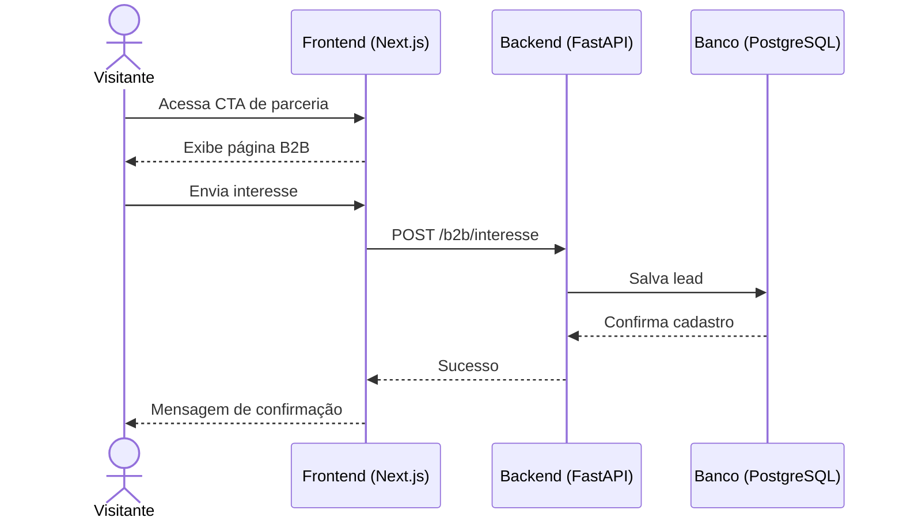

# Diagrama de Sequência

## Fluxo principal: compra local via WhatsApp

## Fluxo alternativo: deep link de afiliada

## Fluxo principal: cadastro B2B

## Premissas de comportamento
- a validação geográfica fica no front-end;
- produtos afiliados não são consultados no banco local;
- o backend trata apenas dados locais e administrativos;
- o fluxo B2B é um mero redirecionamento externo;
- o fechamento de venda local ocorre via WhatsApp e não por checkout nativo.
