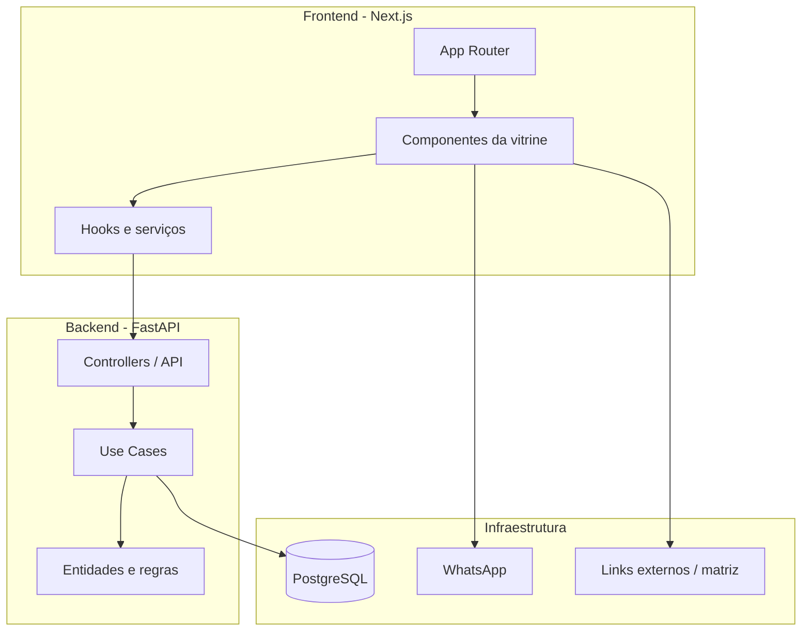

# Diagrama de Componentes

## Visão geral da arquitetura
A aplicação foi pensada para separar claramente a camada de apresentação, regras de negócio, integrações e persistência. Isso mantém o frontend leve, o backend focado em operações de estoque e o sistema fácil de evoluir.

## Camadas do sistema

### 1. Camada de apresentação
- Next.js + React
- páginas públicas da vitrine
- páginas administrativas
- componentes visuais para estoque local, deep links, PDF e B2B

### 2. Camada de aplicação
- hooks e serviços do frontend
- use cases e controllers do backend
- geração de links de WhatsApp
- lógica de autenticação e autorização

### 3. Camada de domínio
- entidades e regras de produto local
- regras de região geográfica
- regras de publicação e disponibilidade

### 4. Camada de infraestrutura
- PostgreSQL
- FastAPI
- integrações externas com WhatsApp e URLs de afiliada
- arquivos de configuração e ambiente

## Dependências principais
- frontend depende de APIs públicas para listar produtos e conteúdo
- backend depende do banco para produtos físicos e dados administrativos
- frontend depende de URLs externas para links de afiliada
- frontend não persiste produtos externos no banco local

## Observações de implementação
- a regra de geolocalização fica no frontend para reduzir chamadas desnecessárias ao backend;
- a API pública serve apenas dados locais e conteúdos de vitrine;
- os links de afiliada são configurados como URLs externas, não como entidades do banco de produtos;
- o admin mantém o controle sobre estoque e catálogo físico.
