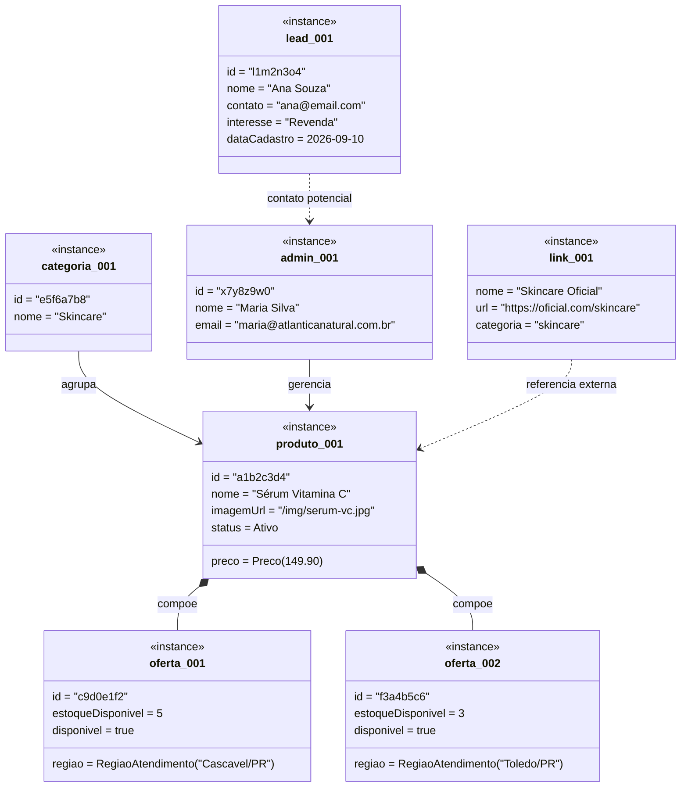

# Diagrama de Objetos

Instantâneo (snapshot) do diagrama de classes em tempo de execução, validando as multiplicidades e relações definidas no diagrama de classes.

> **Notação Mermaid:** como o Mermaid não tem diagrama de objetos nativo, usamos `classDiagram` com o estereótipo `<<instance>>` e valores concretos, sem métodos.

## Cenário: cliente confirma região e envia mensagem via WhatsApp

O cliente visualiza um produto de skincare, confirma que sua região está coberta e envia mensagem de interesse via WhatsApp. Este cenário valida as cardinalidades: um produto com uma oferta local, e um link externo de configuração (não persistente).

## Validação de multiplicidades

| Relação do diagrama de classes | Validação neste snapshot | Status |
|---|---|---|
| `Categoria "1" --> "0..* Produto"` | Uma categoria (Skincare) com 1 produto registrado | OK |
| `Produto "1" *-- "1..* OfertaLocal"` | Um produto (Sérum) composto por 2 ofertas locais (Cascavel/Toledo) | OK |
| `Administrador "1" --> "0..* Produto"` | Um admin gerenciando 1 produto | OK |
| `LinkExterno` sem persistência | Configurado como valor externo, não está na tabela de objetos persistentes | OK |
| `LeadB2B` independente | Lead registrado sem vínculo a produto | OK |

## Observação
Este diagrama serve como massa de teste para os testes de aceitação do `RF01` (exibir estoque físico) e `RF07` (gerenciar produto): as instâncias acima descrevem dados que alimentam os cenários de teste de integração.