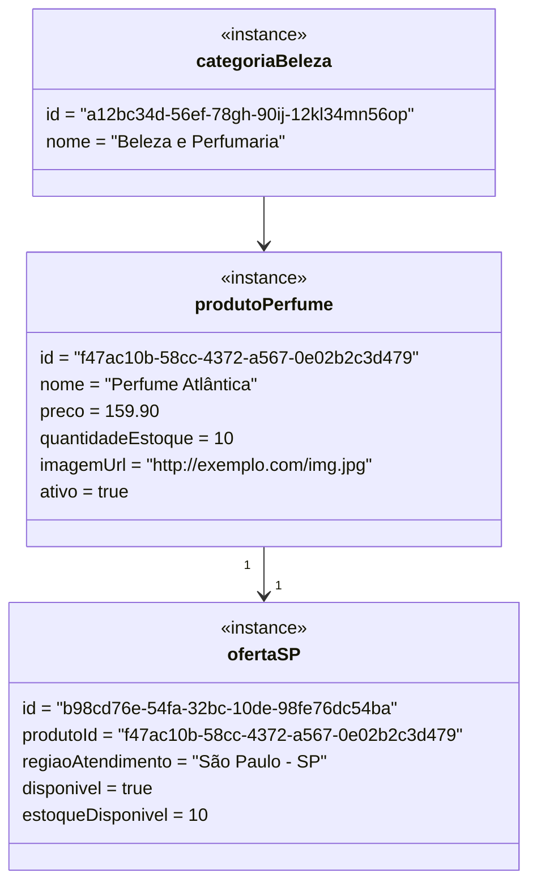

# Diagrama de Objetos

Este diagrama exemplifica um cenário real de execução, ilustrando as entidades e seus valores em um momento específico para validar as cardinalidades definidas no diagrama de classes.

## Cenário: Produto com Oferta Local
Neste cenário, temos um produto associado a uma categoria e uma oferta local que define sua disponibilidade para a região de "São Paulo - SP".

