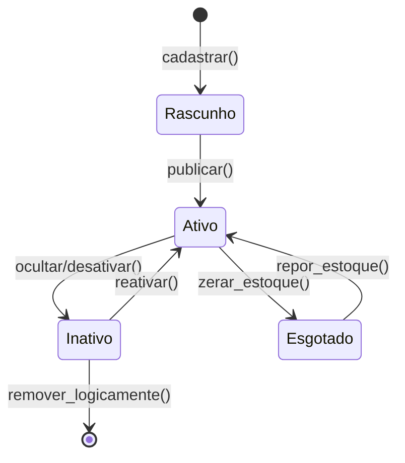

# Diagrama de Estados

O diagrama de estados detalha o ciclo de vida de entidades que possuem status complexos e regras de transição.

## Entidade: Produto (Estoque Físico)
O `Produto` possui um ciclo de vida simples focado na sua disponibilidade para a vitrine.

