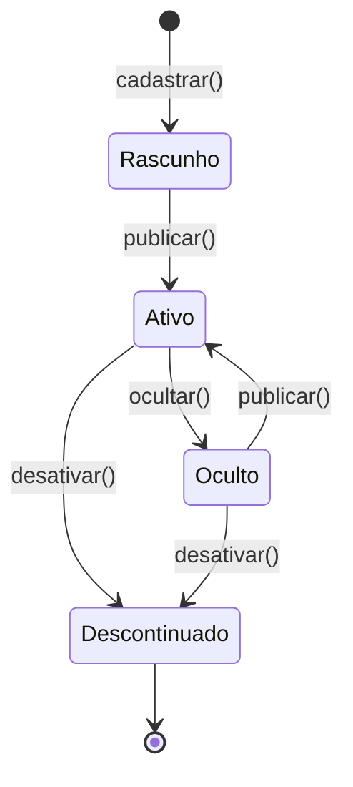
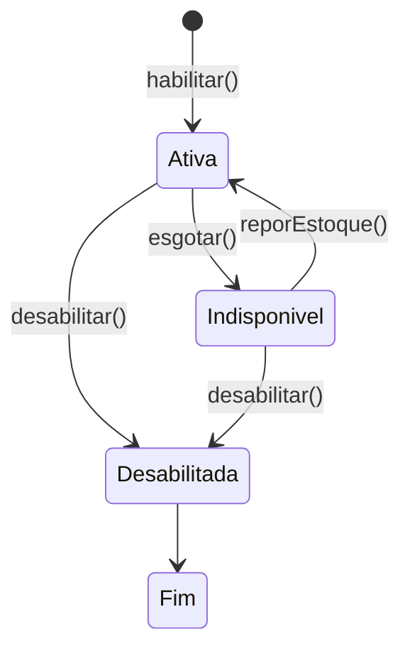
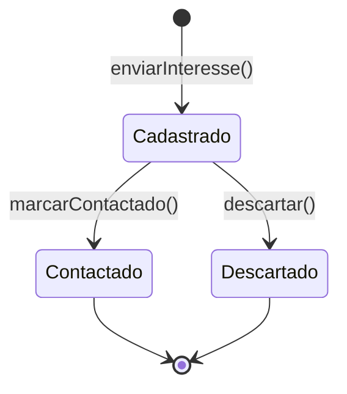

# Diagrama de Estados

Entidade com ciclo de vida complexo neste sistema: **`Produto`**. Status possíveis, regras de transição e transições condicionais.

---

## Produto

Ciclo de vida do produto físico cadastrado na vitrine. O status controla se o produto está visível ao público e qual comportamento a interface adota.

| Transição | Evento / Guarda | Ação | Quem pode acionar |
|---|---|---|---|
| Rascunho → Ativo | `publicar()` | Produto fica visível na vitrine | Administrador |
| Ativo → Oculto | `ocultar()` | Produto é ocultado do catálogo público, estoque mantido | Administrador |
| Oculto → Ativo | `publicar()` | Produto volta a ficar visível | Administrador |
| Ativo → Descontinuado | `desativar()` | Remoção lógica, estoque é zerado | Administrador |
| Oculto → Descontinuado | `desativar()` | Mesma lógica, sem precisar passar por Ativo | Administrador |
| Descontinuado → Fim | — | Estado terminal, sem retorno ao catálogo | — |

> Regra de negócio: `desativar()` só pode ser chamado se `status != Descontinuado`. `publicar()` só pode ser chamado se `status != Descontinuado`. O estado `Descontinuado` é final (ciclo de vida encerrado).

---

## OfertaLocal

Ciclo de vida da oferta geográfica vinculada a um produto. Controla se a região de atendimento está ativa para aquele item.

| Transição | Evento / Guarda | Ação |
|---|---|---|
| Ativa → Indisponivel | `esgotar()` / estoque = 0 | Região fica inacessível até reposição |
| Indisponivel → Ativa | `reporEstoque()` | Reposição de estoque reativa a região |
| Ativa → Desabilitada | `desabilitar()` | Admin remove a oferta daquela região |
| Indisponivel → Desabilitada | `desabilitar()` | Pode ser desabilitada mesmo sem estoque |
| Desabilitada → Fim | — | Estado terminal |

---

## LeadB2B

Ciclo simples: o lead é cadastrado e marcado como contactado quando a revendedora entra em contato.

> Leads B2B não têm ciclo complexo — são apenas registro de interesse. Estes diagramas validam o atributo de status no diagrama de classes (seção 4) e servem como base para as regras de transição que serão implementadas como validação nas entidades de domínio.