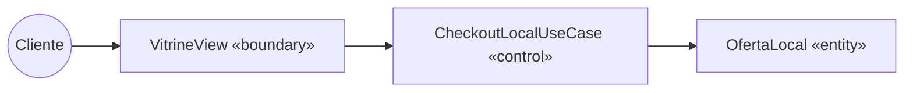

# Classes de Fronteira, Controle e Entidade (BCE)

Mapeamento das classes do sistema seguindo o padrão Boundary-Control-Entity para os casos de uso principais.

## Diagrama de Robustez (Exemplo: Confirmar região e ir para WhatsApp)

## Tabela de Mapeamento

| Caso de Uso | Boundary | Control | Entities Envolvidas |
|-------------|----------|---------|---------------------|
| UC01 - Visualizar vitrine pública | `VitrineView`, `ProdutoController` | `ListarProdutosVitrineUseCase` | `Produto`, `Categoria`, `OfertaLocal` |
| UC02 - Confirmar região | `RegiaoDialogView` | `ValidarRegiaoUseCase` | `OfertaLocal` |
| UC03 - Enviar mensagem via WhatsApp| `WhatsAppRedirectView` | `GerarLinkWhatsAppUseCase` | `Produto`, `OfertaLocal` |
| UC07 - Cadastrar Produto | `AdminPanelView`, `AdminProdutoController` | `CadastrarProdutoUseCase` | `Produto`, `Categoria` |
