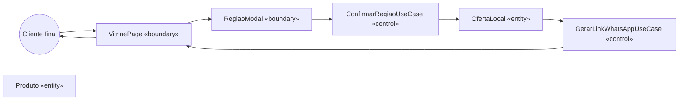
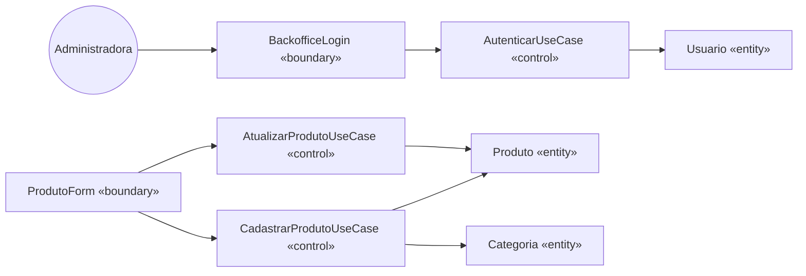
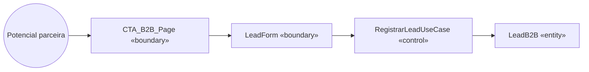

# Boundary-Control-Entity

Reclassificação das classes do diagrama de classes (seção 4) em três estereótipos de análise. Essa separação se materializa nas camadas de Clean Architecture (seção 13):

- **Boundary (Fronteira)** → Interface Adapters (camada de entrada)
- **Control (Controle)** → Application/Use Cases
- **Entity (Entidade)** → Domain/Entities

---

## Diagrama de robustez — Fluxo de compra local via WhatsApp

---

## Diagrama de robustez — Backoffice (gestão de produto)

---

## Diagrama de robustez — Captação B2B

---

## Tabela de mapeamento Boundary-Control-Entity por caso de uso

| Caso de Uso | Boundary | Control | Entities envolvidas |
|---|---|---|---|
| UC01 - Visualizar vitrine pública | VitrinePage | — (renderização direta do frontend) | Produto, OfertaLocal |
| UC02 - Confirmar região para compra local | VitrinePage + RegiaoModal | ConfirmarRegiaoUseCase | OfertaLocal |
| UC03 - Enviar mensagem via WhatsApp | VitrinePage | GerarLinkWhatsAppUseCase | Produto, OfertaLocal |
| UC04 - Navegar por links externos de afiliada | LinkCard (componente) | — (redirecionamento simples) | — |
| UC05 - Visualizar catálogo em PDF | CatalogoPDF (componente) | — (renderização embutida) | — |
| UC06 - Acessar página de captação B2B | CTA_B2B_Page + LeadForm | RegistrarLeadUseCase | LeadB2B |
| UC07 - Cadastrar ou atualizar produto físico | BackofficeLogin + ProdutoForm | AutenticarUseCase + CadastrarProdutoUseCase / AtualizarProdutoUseCase | Usuario, Produto, Categoria |
| UC08 - Autenticar no backoffice | BackofficeLogin | AutenticarUseCase | Usuario |

---

## Regras de mapeamento
- **Boundary**: 1 boundary por tela/interface de ator. Nome `XxxPage`, `XxxForm`, `XxxModal`.
- **Control**: 1 control por caso de uso (ou agrupamento coeso de casos de uso relacionados). Nome `XxxUseCase`.
- **Entity**: entidades vêm do diagrama de classes (seção 4). Sem dependência de framework.

## Nota de rastreabilidade
Cada boundary/control/entity desta tabela aparece nos diagramas de sequência (seção 6) com os mesmos nomes, garantindo rastreabilidade: requisito → caso de uso → robustez → sequência.