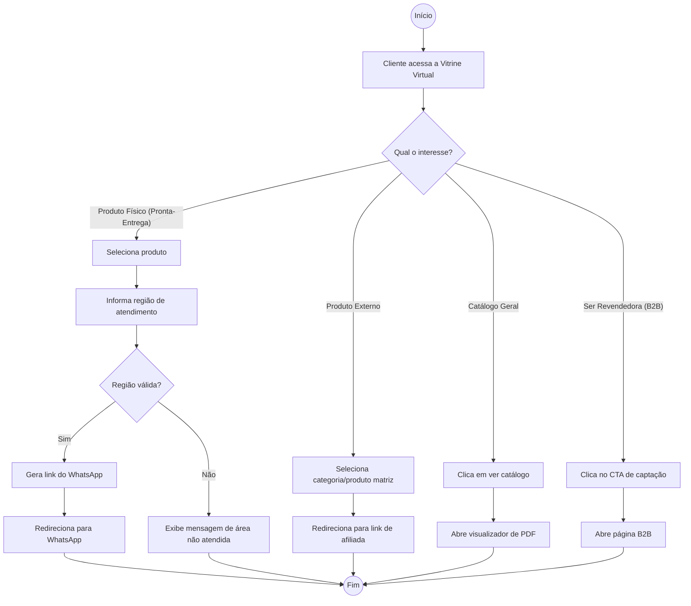

# Diagrama de Atividades

Este diagrama representa o fluxo principal de um cliente na vitrine virtual, escolhendo entre comprar um produto local, acessar um link externo ou visualizar o catálogo.

```mermaid
flowchart TD
    Start((Início)) --> A1[Cliente acessa a Vitrine Virtual]
    A1 --> D1{Qual o interesse?}
    
    D1 -- Produto Físico (Pronta-Entrega) --> A2[Seleciona produto]
    A2 --> A3[Informa região de atendimento]
    A3 --> D2{Região válida?}
    D2 -- Sim --> A4[Gera link do WhatsApp]
    A4 --> A5[Redireciona para WhatsApp]
    D2 -- Não --> A6[Exibe mensagem de área não atendida]
    
    D1 -- Produto Externo --> A7[Seleciona categoria/produto matriz]
    A7 --> A8[Redireciona para link de afiliada]
    
    D1 -- Catálogo Geral --> A9[Clica em ver catálogo]
    A9 --> A10[Abre visualizador de PDF]
    
    D1 -- Ser Revendedora (B2B) --> A11[Clica no CTA de captação]
    A11 --> A12[Abre página B2B]
    
    A5 --> End((Fim))
    A6 --> End
    A8 --> End
    A10 --> End
    A12 --> End
```
