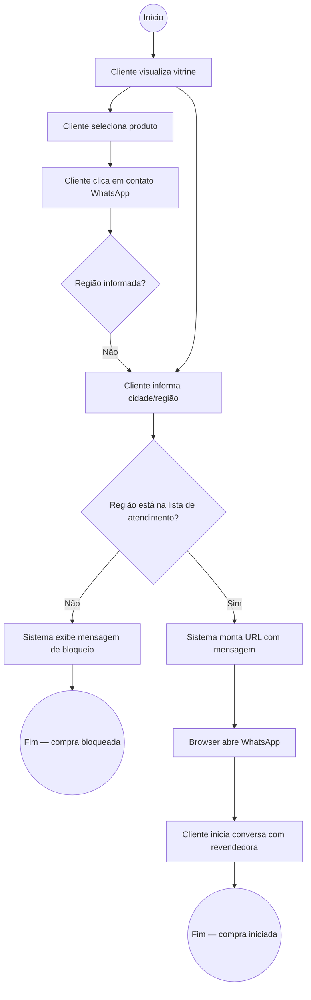
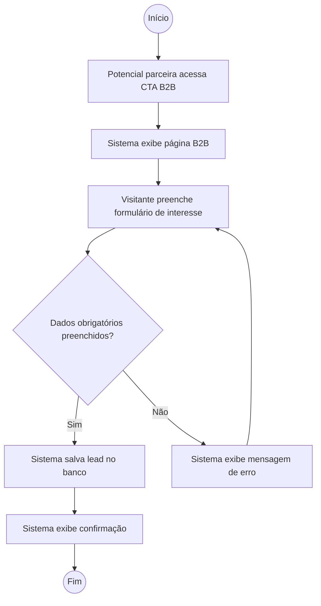
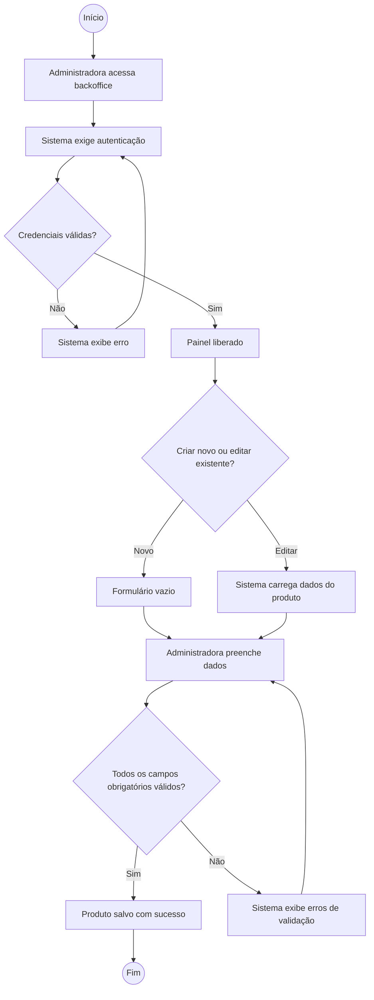

# Diagrama de Atividades

Fluxos de decisão, alternativas e processos ponta a ponta do sistema.

---

## 1. Fluxo de compra local: validação geográfica → WhatsApp

Raia **Cliente** / Raia **Sistema (Frontend)** — decisão e alternativa.

> **Decisões:** `Região informada?` (verifica se o cliente já informou). `Região está na lista?` (verifica no front-end se a cidade está na coleção de regiões válidas).

---

## 2. Fluxo de cadastro B2B

Raia **Potencial parceira** / Raia **Sistema** — sem paralelismo.

---

## 3. Fluxo de gestão de produto (backoffice)

Raia **Administradora** / Raia **Sistema Backend** — decisão de criação/edição.

---

## Observações
- Os diagramas de atividades complementam os de sequência (seção 6) ao mostrar decisões e alternativas de fluxo; a ordem temporal fica nos de sequência.
- Para paralelismo neste sistema (não há no momento), usar raias ou fork/join com anotação `(fork)`/`(join)` no label do nó.
- Se sistema tiver múltiplos atores no mesmo fluxo, descrever raias antes do diagrama e listar quais ações pertencem a cada raia.